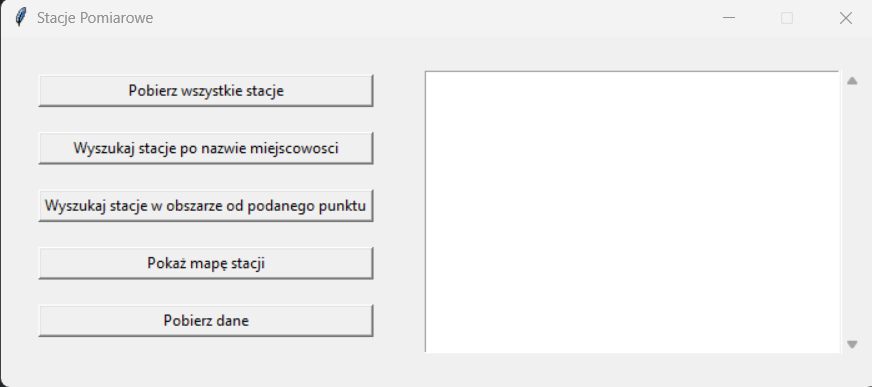
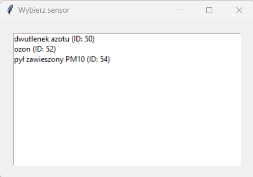
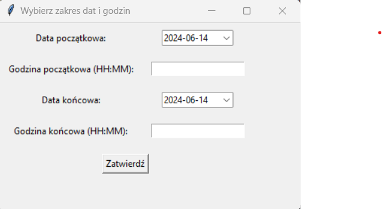

# Pobieranie danych stacji pomiarowych w Polsce

Powyższy projekt pozwala na pobranie danych pomiarowych publikowanych
bezpłatnie przez Główny Inspektorat Ochrony Środowiska poprzez usługę
REST.

# Spis treści
1. Opis
2. Instalacja
3. Użycie

## Opis
Celem projektu jest zaprezentowanie aplikacji, której zadaniem jest
możliwość pobrania z API danych pomiarowych ze stacji diagnostycznych
z Głównego Inspektoratu Ochrony Środowiska i zapisania jej do lokalnej
bazy danych w celu późniejszego odczytu. Aplikacja potrafi odfiltrować
dane poprzez podane w GUI informacje, a nstępnie wyświetlić pobrane
dane na wykresie z dokonaniem prostej analizy. W folderze znadjduje się
plik requirements.txt z wymaganymi bibliotekami do projektu.

## Instalacja 
Aby uruchomić aplikacje należy:
1. Pobrać pliki z platformy GitHub.
2. Otworzyć wiersz poleceń CMD.
3. W konsoli wpisujemy "cd {ścieżka w której znajdują sie praca}\PracaZaliczeniowa",
następnie "venv\Scripts\activate".
4. Przed użyciem należy pobrać biblioteki wskazane w pliku requirements.txt
5. Aby uruchomić program trzeba wpisać w wierszu poleceń
komende "python main.py".
6. Aby uruchomić testy należy wpisać w wierszu poleceń "pytest"

## Użycie
Po uruchomieniu się aplikacji pojawi się okno główne na którym znajdują się funkcje.

- "Pobierz wszystkie stacje" aplikacja 
wyświetli w listboxie obok wszystkie dostępne stacje pomiarowe
- "Wyszukaj stacje po nazwie miejscowości" aplikacja poprosi
o podanie miejscowości a następnie wyświetli w listboxie obok wszystkie dostępne stacje w podanej miejscowości
- "Wyszukaj stacje w obszarze od podanego punktu" aplikacja poprosi
o podanie miejsca a następnie promienia (w km) od wskazanego miejsca, po
czym wyswietli dostepne stacje w listboxie
- "Pokaż mapę stacji" aplikacja wyświetli w przeglądarce wszystkie stacje, 
a po naciśnięciu na znacznik wyświetli się adres danej stacji oraz ID stacji
- "Pobierz dane" aplikacja pobierze dane z API do lokalnej bazy danych (może to potrwać kilka minut), 
 w trybie offline (dane są pobierane do 2 dni wstecz).
- Stację pomiarową zatwierdzamy poprzez wciśnięcie dwukrotnie lewego przycisku myszy
- Po zatwierdzeniu stacji wyskoczy okno z wyborem stanowiska

- Stanowsiko wybieramy poprzez dwukrotne kliknięcie lewym przyciskiem myszy
- Następnie zostaniemy poproszeni aby podać zakres z jakiego chcemy pobrać dane

- Datę wybieramy z rozwijanego okna kalendarza, a godzine podajemy w formacie HH:MM
- Po zatwierdzeniu zakresu wyświetli się wykres z zaprezentowanymi danymi.
- Aplikacja działa również w trybie offline z ograniczoną funkcjonalnością

Erwin Stępniewski